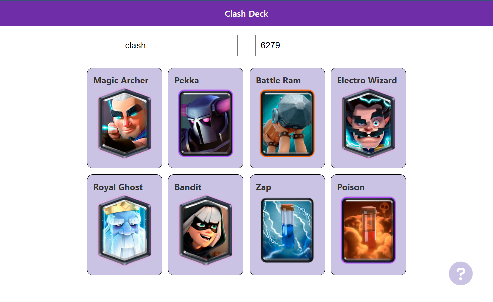

# clashdeck

https://clashdeck.netlify.app

Site that displays your Clash Royale opponent's deck. 

Enter your Clash Royale opponent's name and trophy count before a game starts. Once the correct player is found their deck will be displayed.



---


The backend is done in **Python** with **Flask**. It's hosted on **Heroku**. 

The frontend is done with **Angular** and **TypeScript**. It's hosted on **Netlify**.

---

To run the backend:
* Must have Python 3 installed (currently using 3.10.5).
```
$ pip install -r requirements.txt
$ python3 wsgi.py
```

To run the frontend:
* Must have npm and the Angular CLI installed (currently using npm 8.11.0, Angular 10.1.6 and node 16.15.1).
```
$ npm i
$ ng serve
```
